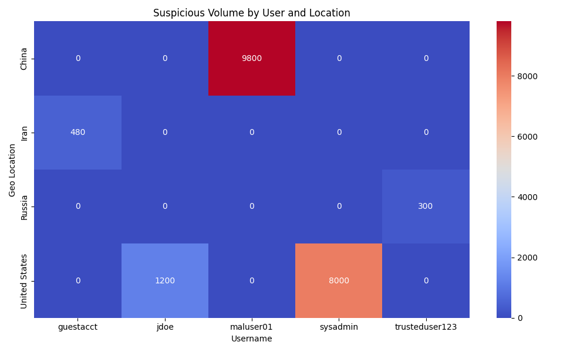
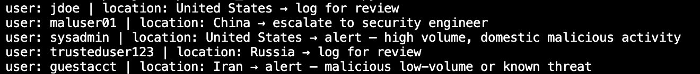

# Threat Detection Tool – Python

### Keep Humans in the Loop

This research demonstrates how **human logic remains essential** for identifying advanced, low-noise threats that often evade traditional rule-based or AI-only detection systems. 
It simulates real-world behaviors like:
- Low-volume activity from trusted accounts and unusual geolocations
- Logins from unusual geolocations
- Timing-based anomalies (i.e., suspicious login intervals)

By emphasizing behavioral context + risk-relevant logic, the detection engine is designed to support security engineers, threat hunters, and analysts who want scalable yet tunable detection logic. 
That can be tuned for a wide scale of use cases.
---

## Key Features
- Custom Python logic for volume, location, and user-based behavior designed based on relevant geopolitcal trends 
-Corrected AI/Open-Source Security log analyzers and integrated strengths into updated logic 
- Heatmap visualization for executive summaries or SOC review
- Low false positive design — flags edge cases often missed
- Scalable for startups or large orgs via username-based logic
- Easy to enrich with geolocation/IP reputation or user privilege tiers
- Refined AND/OR logic to reduce false positives and improve detection accuracy
- Behavior-focused detection, not just IOC/volume-based
- Includes correction logic that captures slow, low-noise APT behaviors

---

## Why This Is Relevant 

The use of AI and automation is becoming required in security operations to protect assets, confidential information, etc. 

Many detection systems rely on:
- Risky IP scores
- Known IOCs
- Login failure thresholds

But an APT or insider threat can:
- Bypass with valid credentials
- Use smooth, spaced logins
- Avoid tripping alerts without volume

This tool simulates those gaps and lets security professionals tweak logic to reflect their own use cases:
- Size
- Known good users -- manually/with one csv for this example but supports CSV lists, LDAP queries, or API calls to identity providers (i.e., Okta, Azure AD)
- Data sensitivity

---

## Visualize the Threat

The heatmap output offers a high-signal, low-noise visualization that can:
- Brief executives on user behavior spikes
- Highlight internal anomalies
- Justify access review or monitoring



---

## How to Use

1. Add your logs to the `sample_logs/` folder (CSV format)
2. Update trusted users list in `threat_detector.py`
3. Run the detection engine:
```bash
python threat_detector.py
```
4. Visualize output:
```bash
python visualize_volume_heatmap.py
```
5. Adapt to your own use case 

- Copy/paste directly into your project
- Swap in your own logs
- Modify logic. parameters, and `trusted_users`  manually, import CSV lists, LDAP queries, or API calls to identity providers (i.e., Okta, Azure AD)

---

## Sample Logic (Snippet)
```python
# case 2 – high-volume domestic malicious activity
elif (
    log_entry["volume_MB"] > 5000
    and log_entry["geo_location"] == "United States"
    and log_entry["known_malicious"] == "True"
):
    return "alert – high volume, domestic malicious activity"

# case 3 – hybrid logic: low-volume foreign OR any known malicious indicator
elif (
    (log_entry["volume_MB"] < 5000 and log_entry["geo_location"] != "United States")
    or log_entry["known_malicious"] == "True"
) and log_entry["username"] not in trusted_users:
    return "alert – malicious low-volume or known threat"

# case 4 – small ping from within the u.s. from an untrusted user
elif (
    log_entry["volume_MB"] < 5000
    and log_entry["geo_location"] == "United States"
    and log_entry["username"] not in trusted_users
):
    return "alert – suspicious low-volume from untrusted internal user"
```

---

## Inspired By & Improved On...

Inspired by both open-source scripts and AI-generated detection logic — ***but many lacked behavioral nuance and organizational context.***

### Example Source Logic (External Code)
```python
import numpy as np
from scipy import stats
from datetime import datetime
from collections import Counter

class AdvancedThreatDetector:
    def __init__(self, log_entries):
        self.log_entries = log_entries
        self.threat_weights = {
            'login_attempts': 0.4,
            'unique_endpoints': 0.3,
            'request_volume': 0.2,
            'time_concentration': 0.1
        }

    def ml_anomaly_detection(self):
        request_times = [datetime.strptime(entry['timestamp'], '%d/%b/%Y:%H:%M:%S %z') 
                         for entry in self.log_entries]  
        request_intervals = [
            (request_times[i+1] - request_times[i]).total_seconds() 
            for i in range(len(request_times) - 1)
        ]     
        if len(request_intervals) < 2:
            return []     
        z_scores = np.abs(stats.zscore(request_intervals))   
        anomalies = [
            {
                'timestamp': str(request_times[i]), 
                'interval': f"{request_intervals[i]:.2f} seconds", 
                'z_score': z_score
            }
            for i, z_score in enumerate(z_scores)
            if z_score > 2.5  
        ]  
        return anomalies

    def predict_future_threats(self):
        ip_attack_patterns = Counter()
        for entry in self.log_entries:
            if entry.get('is_failed_login', False):
                ip_attack_patterns[entry['ip']] += 1
        potential_targets = ip_attack_patterns.most_common(3) 
        return {
            'potential_targets': [ip for ip, count in potential_targets],
            'attack_pattern_confidence': dict(ip_attack_patterns)
        }

    def calculate_ip_threat_score(self, ip):
        ip_entries = [entry for entry in self.log_entries if entry['ip'] == ip]
        failed_logins = sum(1 for entry in ip_entries if entry.get('is_failed_login', False))
        login_score = min(failed_logins * 10, 40)  
        unique_endpoints = len(set(entry['endpoint'] for entry in ip_entries))
        endpoint_score = min(unique_endpoints * 5, 30)   
        request_volume = len(ip_entries)
        volume_score = min(request_volume * 2, 20)
        if ip_entries:
            timestamps = [datetime.strptime(entry['timestamp'], '%d/%b/%Y:%H:%M:%S %z') for entry in ip_entries]
            time_spread = (max(timestamps) - min(timestamps)).total_seconds()
            time_score = 10 if time_spread < 60 else 0  
        else:
            time_score = 0    
        total_score = login_score + endpoint_score + volume_score + time_score
        return min(total_score, 100)
```
> This code was well-structured but lacked privilege-aware logic and deeper contextual tuning — particularly for low-noise actor detection.

---

## Combined Snippet: Enhanced Detection + Interval Logic
```python
if (
    log_entry["volume_MB"] > 5000
    and log_entry["geo_location"] != "United States"
    and log_entry["known_malicious"] == "True"
):
    return "escalate to security engineer"
elif (
    log_entry["username"] not in trusted_users
    and login_interval_score > 2.5
):
    return "alert – suspicious login pattern from untrusted user"
```
> This combines volume, location, and behavior flags with statistical interval outliers. Together, it tightens detection where typical logic might miss evasive activity.

---

## future expansions coming 
- Integrate with SOAR tools or TheHive for auto-escalation
- Add LLM prompts for human-in-the-loop decisioning
- Use VirusTotal API or Recorded Future for real-time IP enrichment

---

```md
---

## Full Working Script ( Demo)
full combined detection logic that ran successfully in VS Code?
Check out `optimized_threat-detector.py` for the fully functional version.
---

## Demo – Optimized Threat Detector Output

This run reflects logic that combines:
- Behavior-based detection
- Statistical interval outliers
- Privilege-aware tuning

The output shows how different user behaviors are triaged — not just by volume or location, but contextually--i.e domestic AND malicious AND high volume) 



---

## files
- `threat_detector.py`: main detection logic
- `optimized_threat-detector_output.py`: optimized code  
- `visualize_volume_heatmap.py`: heatmap generator
- `sample_logs/`: sample logs
- `heatmap_output.png`: sample output image
- `optimized_threat-detector_output.png`: optimized code output 
---

## Author
Made by [@sogars](https://github.com/sogars). If you're in security and want to chat — feel free to connect. : ]

> NOTE: Snippets incorporated are made to elevate code and give credit where it is due--not critique it. 
